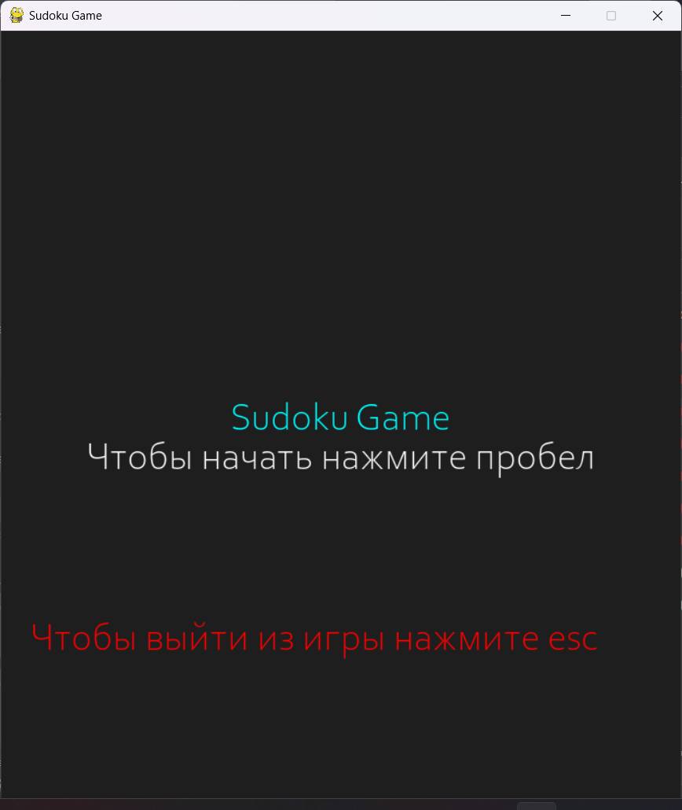
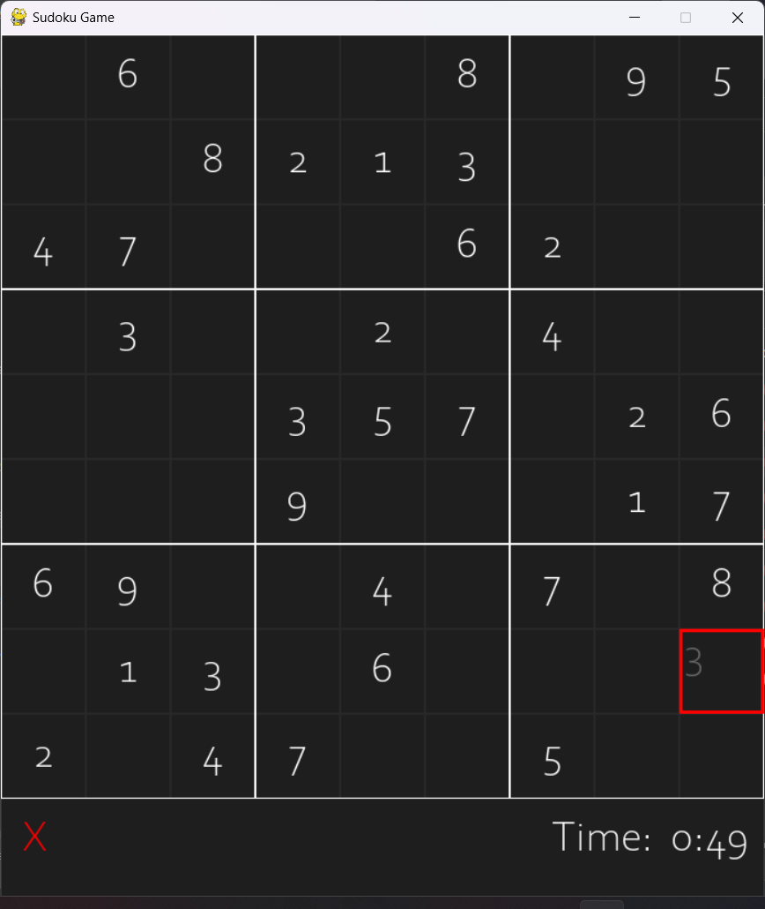

# Игра Судоку с использованием Pygame

## Особенности

- Играйте в Судоку с помощью графического интерфейса Pygame.
- Случайно генерируемые головоломки из датасета.
- Отображение времени, затраченного на решение головоломки.
- Возможность активации алгоритма автоматического решения при нажатии стрелки вверх.

